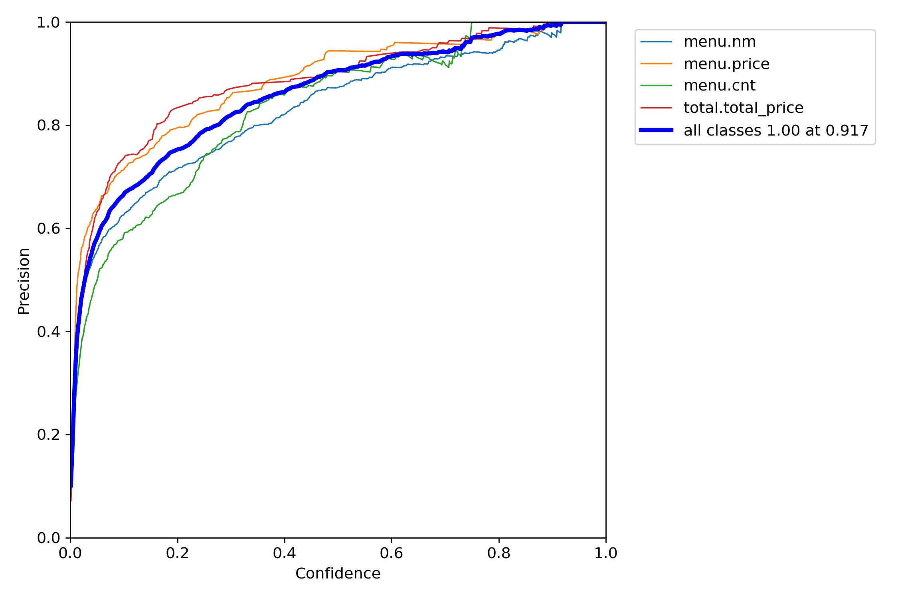
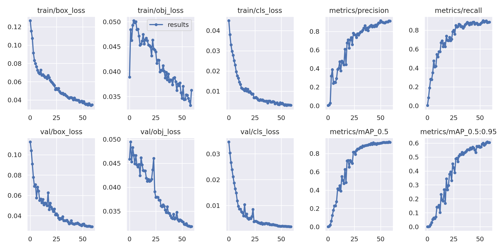

# Example-of-solving-a-CV-problem

Цель проекта: разработать сервис, который сможет обрабатывать фотографии чеков, так что будет оцифрована информация о следующих сущностях в чеках:
- позиция;
- количество позиций в штуках;
- цена;
- общая стоимость.

За основу для обучения моделей и валидации результата был взят датасет по распознаванию текста на чеках - [CORD](https://openreview.net/pdf?id=SJl3z659UH).

Разрабатываемое решение основывается на комбинации двух моделей - дообученой модели компьютерного зрения - YOLO и модели Easy - OCR.

Исходные данные - датасет, состоящий из пар двух файлов - изображение и json-файл с информацией о размеченных сущностях на чеке.

Результат работы 
1. Датасет CORD был преобразован и помещен в папку `dataset`  
2. Была дообучена модель YOLO v 5 s под классификацию 4 классов - nm (наименование позиции в чеке); cnt (количество позиции); price (цена); total (общая стоимость).

 

      
      

3. Проверены и загружены веса для Inference - решения, см. `Inference.ipynb`
